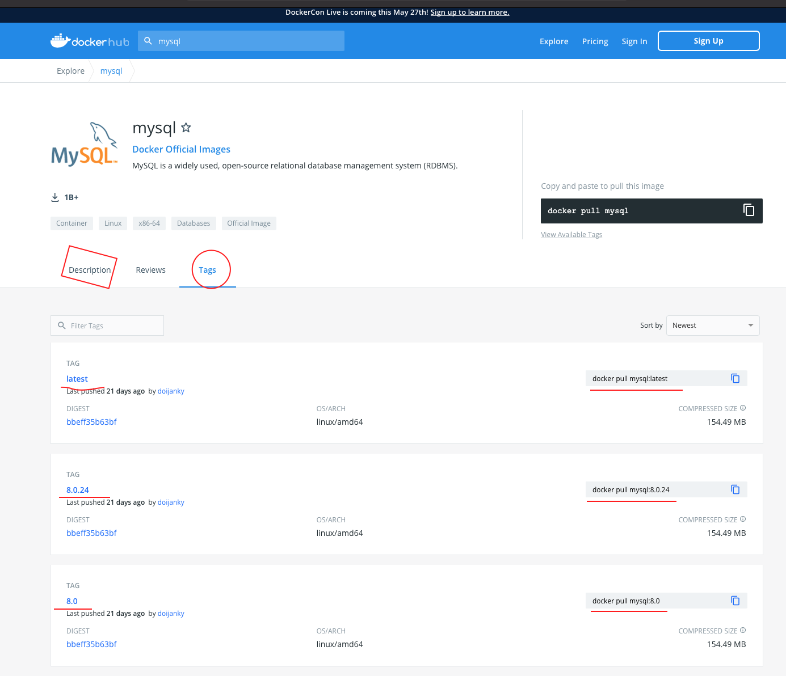

# Docker的简单理解和使用
野火的实时音视频服务器是Docker的镜像，可能有部分客户不太熟悉Docker的概念和使用，这里我们对Docker做一下简单的说明，帮助大家更快的运行起程序。至于更详细的Docker使用说明，还需要从网上查找更多。

## 使用Docker的好处
野火实时音视频服务是c++写的，编译特别麻烦，依赖特别的多，而系统环境又是多变的，所以使用docker能够统一环境，能够快速的运行，方便运维部署。实际上docker的好处远不止这些，目前野火只利用这一个特性。

## Docker的基础概念
可以简单类比电脑，镜像（image）可以理解为操作系统，存储在U盘或者光盘中；需要有个过程来把操作系统安装到电脑上；容器（container）可以理解为已经装好了操作系统的电脑，安装完成后就可以启动（start）/停止（stop）/重启（restart）容器了。类比一下一个电脑的安装和使用过程：
1. 网上查找操作系统版本（镜像和版本）
2. 下载操作系统（镜像）
3. 安装操作系统（Docker run）
4. 使用电脑（容器）
5. 其它一些说明。

## 网上查找操作系统版本
安装电脑之前需要先选择合适的版本，docker也是一样，需要先查询到合适的镜像（image），docker镜像可以在 https://hub.docker.com 查询到，在左上的搜索框中输入关键字搜索，比如 mysql ，打开搜索到的第一个如下图：


图的中间是三个tab页，第一个tab页是描述（Description），对项目的描述，还有一些使用说明等，一般情况下好好好看一下。第三个tabl页是标签（Tags），可以找到自己需要的版本，比如mysql8.

## 下载操作系统（镜像）
选定好镜像和版本以后，下面就是下载了，比如mysql 8，使用下面命令下载镜像
```
sudo docker pull mysql:8
```

查找本机已经存在的镜像：
```
sudo docker iamge ls
```

删除本机已经存在的镜像：
```
sudo docker rmi <image_id>
```

除了从网上下载镜像，也可以把镜像直接导入。野火就是用这种方式，先从网上下载野火音视频服务的镜像:
```
curl -O http://static.wildfirechat.net/wildfire_janus_amd64.tar
```

下载下来镜像以后，然后用下面命令导入镜像:
```
sudo docker load -i wildfire_janus_amd64.tar
```

导入成功后，用下面命令检查刚刚导入的镜像：
```
sudo docker iamge ls
```

## 安装操作系统
操作系统是一张光盘或者是一个大的ISO软件包，需要安装到裸机才能使用，同样镜像也需要安装到容器中才可以使用，安装命令如下：
```
sudo docker run -d --name wf-mysql -e MYSQL_ROOT_PASSWORD=123456 mysql:8
```

这样就安装好了一台名叫```wf-mysql```的数据库电脑。其中run是安装命令，只安装一次就行了，如果再次安装，会提示已经存在了。 ```--name``` 是为容器指定名称，如果不指定名称，则会随机分配一个名字。你可以尝试不带参数 ```--name wf-mysql``` 运行，每次都可以成功，但每次都创建一个新的镜像。

有一个参数是```-d```，是说容器是以守护进程（deamon）方式运行，不会随着当前窗口关闭而结束。

另外一个参数``` -e key=value ``` 参数是指定环境变量，这里指定mysql的root用户密码。一般环境变量都要根据镜像的使用说明来配置。

最后```mysql:8```, mysql是镜像，8是版本号。

好了，运行完上面的命令后，你就会发现出现一句提示，然后就什么都没了。。。是不是心里很慌，别急下面我们看一些它是否在运行：
```
wfcserver:~$ sudo docker ps
CONTAINER ID   IMAGE          COMMAND                  CREATED          STATUS          PORTS                 NAMES
7c72fee89a60   mysql:8   "docker-entrypoint.s…"   20 seconds ago   Up 19 seconds   3306/tcp, 33060/tcp   wf-mysql
```
可以看到mysql的容器正在运行，如果想看已经关机（停掉）的容器怎么办呢，加个-a参数就可以了，如下:
```
sudo docker ps -a
```
就可以看到所有的容器了。

如果想卸载操作系统怎么做，首先先要关机（后面讲如何关机），然后再用如下命令卸载：
```
sudo docker rm wf-mysql
```
这点是和普通电脑不太一样的。

## 操作容器
系统安装好之后就可以开机/关机/重启了。
开机的命令:
```
sudo docker start wf-mysql
```

关机的命令:
```
sudo docker stop wf-mysql
```

重启的命令:
```
sudo docker restart wf-mysql
```

还有更多的参数可以选择，可以用命令来查看参数
