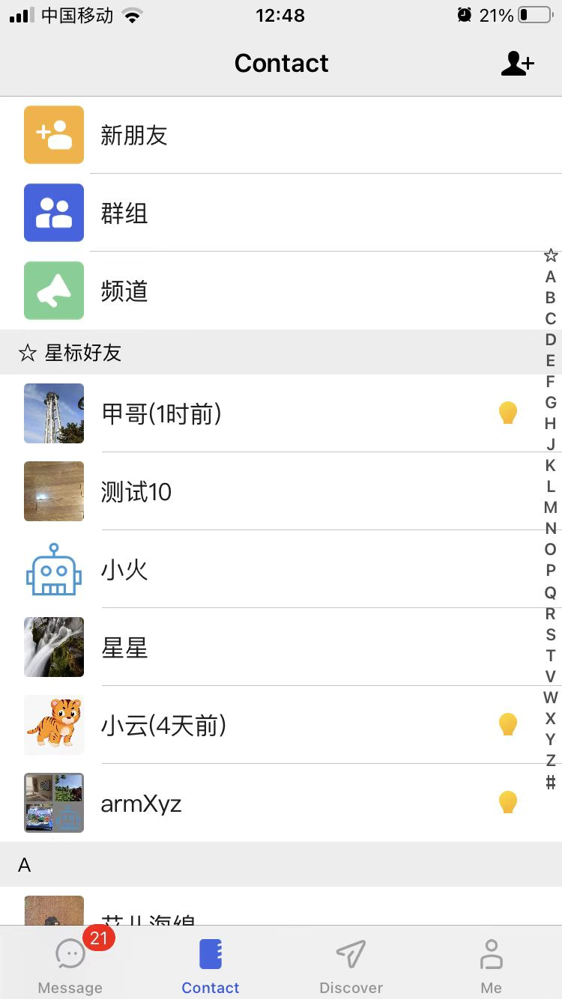
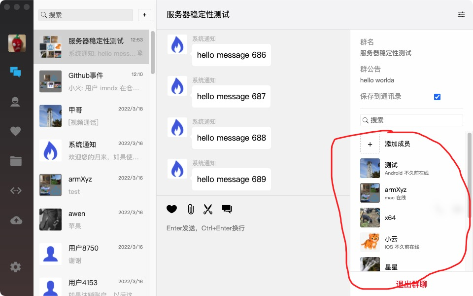

# 野火在线状态简介和开发说明
## 在线状态功能的问题
在线状态是PC时代背景下的产物，PC时代电脑上的社交软件有明确的在线状态，登录上去就是上线，登出或关闭应用就是下线。而在移动互联网下情况发生了变化，手机上社交软件基本都是登录一次，极少登出（换手机的情况下或其它情况），不能持续运行，在后台时都是被冻结或者杀掉。但是有了推送的存在，虽然应用被冻结或杀掉，还是可以及时收到推送信息的提醒。把PC时代的在线状态往移动互联网时代的手机上套是不合适的，所以微信明智地去掉了在线状态，默认大家永远都是在线的。

另外从性能上考虑，在线状态对服务器的性能消耗极大，特别是移动互联网应用。因为手机在线/离线的频率要远大于发消息，而且每次在线/离线触达的用户数要比一般的群组大很多，可能系统90%的资源都会消耗在在线状态功能。

## 为什么野火要实现在线状态
我们也一直以为不会做在线状态功能，但客户在某些场景下确实需要在线状态功能。目前遇到的情况有这么几种：
1. 在线交友，需要能够快速甄别是否在线进行匹配。
2. 企业办公，需要知道对方是不是电脑端在线。甚至可能内网环境下只有PC客户端，这样就退回到PC时代。

特别是企业办公场景，这时野火的主要应用目标。虽然可以通过别的方法可以自己来实现在线状态，但这个功能比较复杂，没有这方面的经验很难做出来，所以我们决定提供在线状态功能。但请谨记，在线状态太消耗资源，非必要不要启动这个功能。

## 服务器实现逻辑
在服务器端是用过订阅方式实现的在线状态功能，当一个用户的在线状态发生改变时，会找出所有订阅他状态的用户，然后给他们发通知。订阅关系分为2种，一种是持久订阅，也就是双方是好友关系，会一直订阅双方的在线状态；另外一种是临时订阅，可以临时订阅非好友个人或者群成员的在线状态，是有实效性的，过了实效后订阅关系取消。

当客户端连接成功后，服务器会通知此用户的所有好友的在线状态（也就是持久订阅用户的在线状态）。当临时订阅成功后，服务器会返回临时订阅目标用户的在线状态（如果临时订阅目标是个人，那就返回这个人的在线状态；如果临时订阅目标是个群组，则返回这个群组成员的在线状态）。在订阅关系存在时，当用户在线状态改变时，服务器会给订阅此用户的用户推送通知。

临时订阅状态是保存在内存中的，如果服务器发生重启，临时订阅状态将会丢失，因此客户端需要周期性的进行订阅。

## 客户端
在客户端需要显示某个人的在线状态时，如果是非好友，需要订阅此用户，当不需要此人的在线状态时，需要取消订阅此用户。当需要显示群组成员在线状态时，也是需要订阅群组在线状态，当不需要显示时取消订阅。切记当不需要时，一定要取消，避免大量的订阅关系导致服务器和客户端的资源消耗。

客户端需要监听在线状态回调，连接成功后会有一次在线状态回调，这个回调里会包含所有好友的在线状态，之后的每次回调都是订阅的用户的状态改变。

在Client层会缓存有用户的在线状态，可以从中获取在线状态。当需要订阅时可以在订阅成功的回调中再刷新一次在线状态。

此外客户端还有接口来修改自定义状态，可以用来设置为忙碌、离开、隐身等状态。

## 在线状态数据
在线状态包括2类数据，一类是设备的在线状态，另一类是自定义状态。所以一个在线状态大概如下：
```
public class UserOnlineState {
    private String userId;
    private int customState;
    private String customText;
    private ClientState[] clientStates;
}
```
其中customState和customText是自定义的状态和状态描述。clientStates是每一个在线设备的状态。

自定义状态和描述我们仅给出部分示例，客户可以自己任意定制不同的意义。需要客户自己来在不同的客户端对齐每个状态的意义。

ClientState的定义如下：
```
public class ClientState implements {
    private int platform;
    private int state;
    private long lastSeen;
}
```
platform是平台，比如ios、android、windows、linux、macos、web和小程序。state是在线状态，0是在线，1是不在线但有session存在。lastSeen是当state为1时，此客户端最后在线的时间。由于野火支持多端登陆，所以ClientState是个数组。

## 在线状态接口
客户端关于在线状态的接口如下，示例代码是android的，其他端基本一致。
### 设置状态监听
```
public void addUserOnlineEventListener(OnUserOnlineEventListener listener);
```

### 设置自定义状态
````
public void setMyCustomState(int state, String text, GeneralCallback callback);
````

### 获取自己的自定义状态
```
public Pair<Integer, String> getMyCustomState();
```

### 获取某个用户的在线状态
````
public UserOnlineState getUserOnlineState(String userId);
````

### 订阅在线状态
```
public void watchOnlineState(int conversationType, String[] targets, int duration, WatchOnlineStateCallback callback);
```

### 取消订阅在线状态
```
public void unWatchOnlineState(int conversationType, String[] targets, GeneralCallback callback);
```

## 如何开启在线状态功能
在线状态功能仅在专业版IM服务支持，需要升级到2020.3.20号以后的专业版IM服务。这个版本之后的服务配置文件中有关于在线状态的开关，打开开关后重启，等待2个小时候会全部生效。另外客户端也需要升级这个日期之后的Client层（包含协议栈）和UI。

## 在线状态UI
野火没有实现完整的客户端UI，因为不同的客户可能对在线状态的UI和交互不同。目前野火只有在联系人界面展示了在线状态，还有进入到会话内展示对方的在线状态。距离完善的UI和交互还比较远，客户应该继续完善。

手机端会话在线状态展示如下：


手机端联系人在线状态展示如下：


PC的群组成员在线状态：


## 总结
只有在特殊应用场景下才启用在线状态功能。在线状态订阅要尽可能的减少，只有在必要的地方进行订阅。当不需要在线状态时一定要取消订阅。在线状态的UI还需要客户自己来完善。
