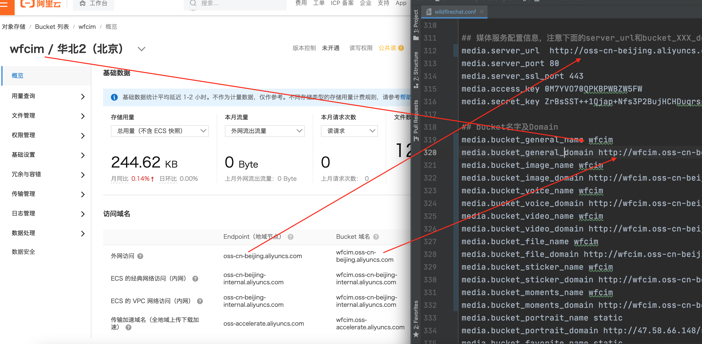
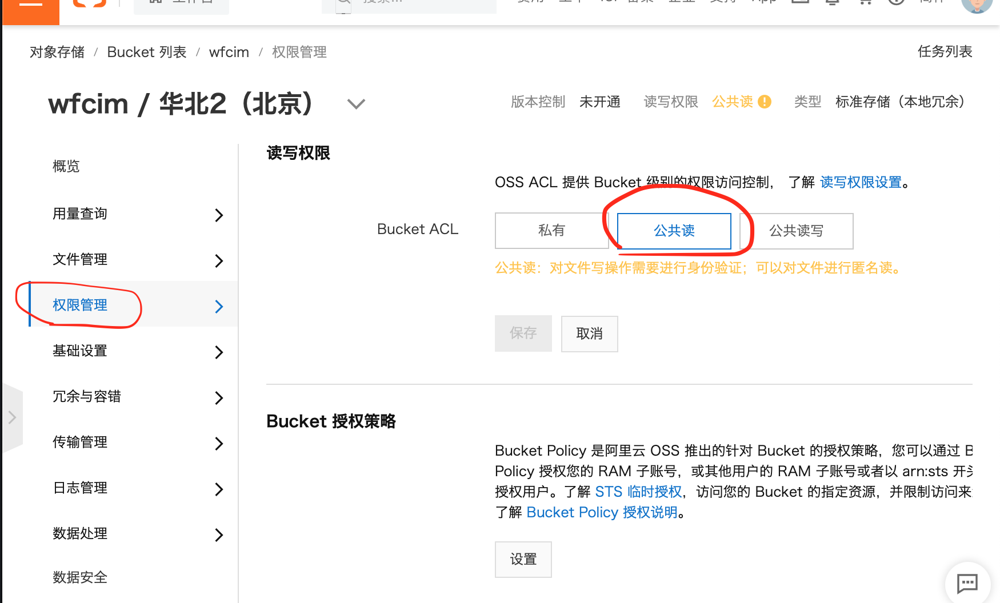

# 对象存储服务
野火IM的消息分为普通消息和媒体消息。媒体消息一般比较大，发送时需要先上传媒体文件到对象存储服务器，得到一个url地址，然后再把包含这个url地址的消息发出去。野火IM社区版支持内置对象存储服务器和七牛对象存储服务器，专业版还可以选择阿里云对象存储和野火私有对象存储。客户端对使用的对象存储服务透明，不用做任何修改和配置。

## 使用内置对象存储服务器。
修改如下配置，```media.server.use_qiniu```配置为0，这样所有媒体文件都将上传到fs目录，按照日期和类型存放。
```
media.server.use_qiniu 0
local.media.storage.root ../fs
```
特别提示：内置对象存储不是一个商业级别的对象存储服务，很多基本的对象存储功能都不支持，仅用来做快速验证和开发测试使用，特别是不支持HTTPS，这样Web的HTTPS站点就无法使用。建议使用七牛云存储，专业版客户也可以使用阿里云云存储和野火私有对象存储。

## 七牛服务器
去七牛官网申请存储服务，修改如下配置，```media.server.use_qiniu```配置为1，填写```access_key```和```secret_key```，```server_url```为上传地址，跟您选择的区有关，请选择正确的地址。然后为不同类型的媒体文件创建不同的bucket，并配置正确。主要要区分长期保存的bucket和会清理的bucket。另外bucket的权限要选择公开，这样接收方可以使用url来访问资源。
```
#专业版的开关名称是media.server.media_type，社区版的是media.server.use_qiniu
media.server.use_qiniu 1
media.server_url  http://up.qbox.me
media.access_key tU3vdBK5BL5j4N7jI5N5uZgq_HQDo170w5C9Amnn
media.secret_key YfQIJdgp5YGhwEw14vGpaD2HJZsuJldWtqens7i5

media.bucket_general_name media
media.bucket_general_domain http://cdn.mediaserver.com
media.bucket_image_name media
media.bucket_image_domain http://cdn.mediaserver.com
media.bucket_voice_name media
media.bucket_voice_domain http://cdn.mediaserver.com
media.bucket_video_name media
media.bucket_video_domain http://cdn.mediaserver.com
media.bucket_file_name media
media.bucket_file_domain http://cdn.mediaserver.com
media.bucket_portrait_name static
media.bucket_portrait_domain http://cdn2.mediaserver.com
media.bucket_favorite_name static
media.bucket_favorite_domain http://cdn2.mediaserver.com
```
> 一定要使用不同的bucket，至少要区分长期保存和短期保存。头像/收藏等需要长期保存，其它根据情况可能会定期清除。
> bucket公开的安全性没有问题，每个文件上传会生成一长串随机数名字，基本不可能穷举到的。如果要选择私有，需要在客户端进行处理，对链接的访问加上七牛的鉴权信息，具体信息请查阅七牛的技术文档。

### 选择正确的server_url
server_url对应不同的七牛存储区域，选择下表中对应区域的服务器上传地址（上传是客户端传的，但客户端模拟的服务器上传，实际上两个地址都可以用）

|  存储区域   | 地域简称  | 上传域名 |
|  ----  | ----  | ---- |
| 华东 | z0 | 服务器端上传：http(s)://up.qiniup.com <br> 客户端上传： http(s)://upload.qiniup.com |
| 华北 | z1 | 服务器端上传：http(s)://up-z1.qiniup.com <br> 客户端上传：http(s)://upload-z1.qiniup.com |
| 华南 | z2 | 服务器端上传：http(s)://up-z2.qiniup.com <br> 客户端上传：http(s)://upload-z2.qiniup.com |
| 北美 | na0 | 服务器端上传：http(s)://up-na0.qiniup.com <br> 客户端上传：http(s)://upload-na0.qiniup.com |
| 东南亚 | as0 | 服务器端上传：http(s)://up-as0.qiniup.com <br> 客户端上传：http(s)://upload-as0.qiniup.com |

### 选择正确的bucket和domain
如下图所示，请绑定域名，使用绑定的域名和正确的bucket。


### 配置HTTPS
可以开启HTTPS增强安全性，另外如果WebIM使用了HTTPS，那么对象存储服务器也必须支持HTTPS。按照七牛网站指引，开启HTTPS功能，注意 ***一定不要开启强制HTTPS***，因为协议栈上传数据是用的HTTP方式。

然后修改配置，domain改成https地址
```
media.bucket_XXXX_domain https://cdn.mediaserver.com
```

## 使用野火IM私有存储
野火IM专业版支持野火IM私有存储，按照[说明](https://github.com/wildfirechat/WF-minio)进行部署。需要注意的是如果添加HTTPS支持，需要确保HTTP同时支持，因为协议栈内会用HTTP的方式上传（数据经过加密上传的）。

### 配置HTTPS
可以开启HTTPS增强安全性，另外如果WebIM使用了HTTPS，那么对象存储服务器也必须支持HTTPS。可以使用Nginx，增加HTTPS访问功能，注意 ***一定不要开启强制HTTPS***，因为协议栈上传数据是用的HTTP方式。

然后修改配置，domain改成https地址
```
media.bucket_XXXX_domain https://cdn.mediaserver.com
```

## 使用阿里云OSS
野火IM专业版支持阿里云对象存储，先去阿里云官网控制台开通对象存储服务。然后在同一个区域内创建至少2个桶（bucket）（一个用来保存头像/收藏等需要长期保存的桶，另外一个用来保存会话内发送的图片、文件、语音、视频等可以定期清除的桶。建议为每种媒体类型都创建一个桶，这里示例就只创建2个桶，可以参考示例为每个类型创建一个桶）。如下图所示：


点击第一个bucket，选择```概览```，配置```endpoint```、```bucket name```和```bucket domain```到图中示例的哪些媒体类型中：

同样配置另外个一个桶的名称和域名到头像和收藏类型。完整配置完如下：
```
media.server_url  http://oss-cn-beijing.aliyuncs.com
media.server_port 80
media.server_ssl_port 443
media.access_key 0M7YVO70QPKBPWBZW5FW
media.secret_key ZrBsSST++1Qjap+Nfs3P2BujHCHDuqrsrYi0zNn8

## bucket名字及Domain
media.bucket_general_name wfcim
media.bucket_general_domain http://wfcim.oss-cn-beijing.aliyuncs.com
media.bucket_image_name wfcim
media.bucket_image_domain http://wfcim.oss-cn-beijing.aliyuncs.com
media.bucket_voice_name wfcim
media.bucket_voice_domain http://wfcim.oss-cn-beijing.aliyuncs.com
media.bucket_video_name wfcim
media.bucket_video_domain http://wfcim.oss-cn-beijing.aliyuncs.com
media.bucket_file_name wfcim
media.bucket_file_domain http://wfcim.oss-cn-beijing.aliyuncs.com
media.bucket_sticker_name wfcim
media.bucket_sticker_domain http://wfcim.oss-cn-beijing.aliyuncs.com
media.bucket_moments_name wfcim
media.bucket_moments_domain http://wfcim.oss-cn-beijing.aliyuncs.com
media.bucket_portrait_name wfcstatic
media.bucket_portrait_domain http://wfcstatic.oss-cn-beijing.aliyuncs.com
media.bucket_favorite_name wfcstatic
media.bucket_favorite_domain http://wfcstatic.oss-cn-beijing.aliyuncs.com
```
到这里您会发现，```media.access_key```和```media.secret_key```还没有配置，这个是您的账户的API密钥。点击您账户的头像，选择```AccessKey 管理```，如果没有accesskey就创建一个。然后配置```access_key```和```secret_key```，如下图：

可以使用子用户的AccessKey，需要注意为该子用户赋予对象存储权限。

### 设置访问权限
点开每个桶的设置，选择权限管理标签页，然后设置读写权限为公共读，如下图所示：


### Web用户
Web用户需要设置跨域信息，详情请参考[这里](https://help.aliyun.com/document_detail/44199.htm)。

### 配置HTTPS
可以开启HTTPS增强安全性，另外如果WebIM使用了HTTPS，那么对象存储服务器也必须支持HTTPS。按照阿里云网站指引，开启HTTPS功能，注意 ***一定不要开启强制HTTPS***，因为协议栈上传数据是用的HTTP方式。

然后修改配置，domain改成https地址
```
media.bucket_XXXX_domain https://wfcim.oss-cn-beijing.aliyuncs.com
```
## 对象存储的安全性
请参考[文件存储的安全性问题](../blogs/文件存储的安全性问题.html)

## 使用其它服务器
如果上述选择都不符合您的需要，你也可以使用任意其他OSS。实现方法就是在客户端上传文件到自己的应用服务器，然后再调用sdk发送消息。
